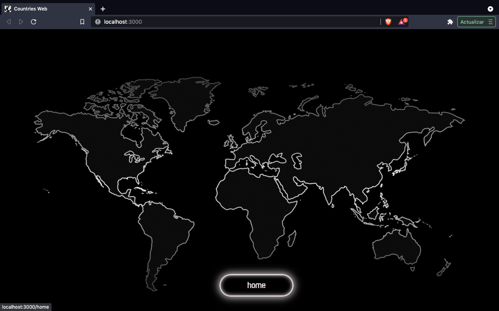
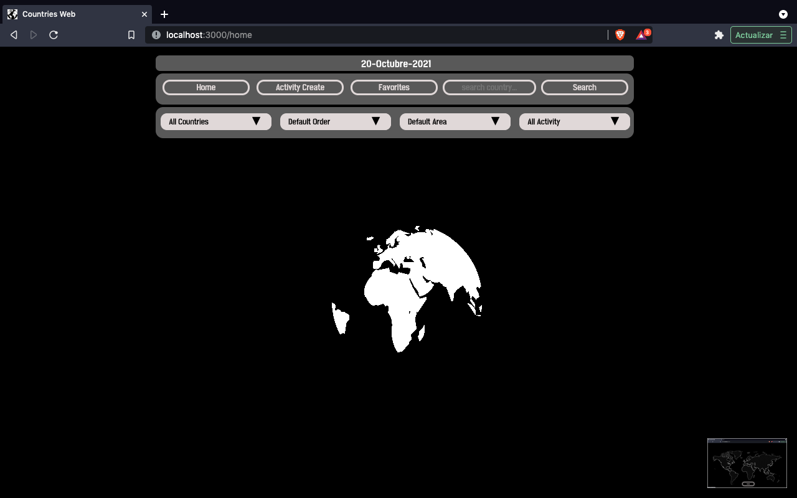
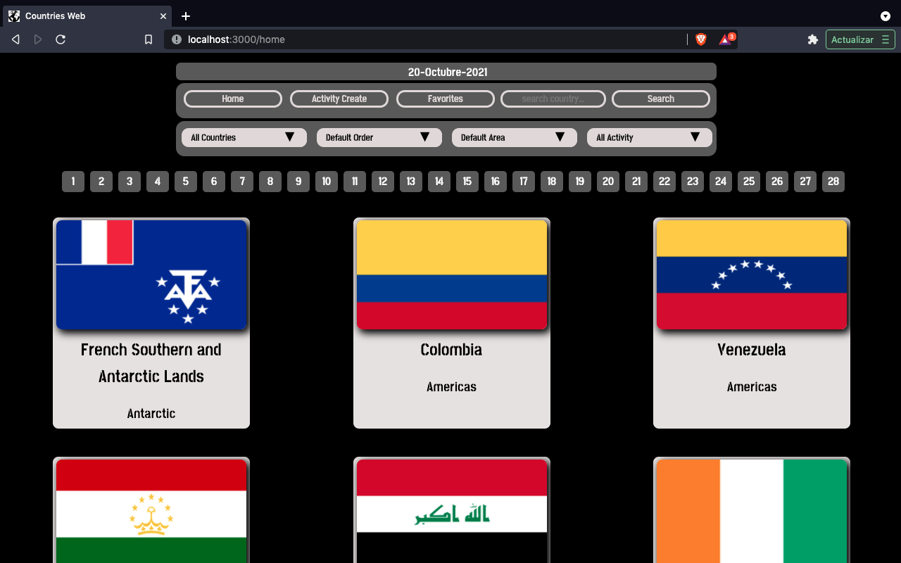
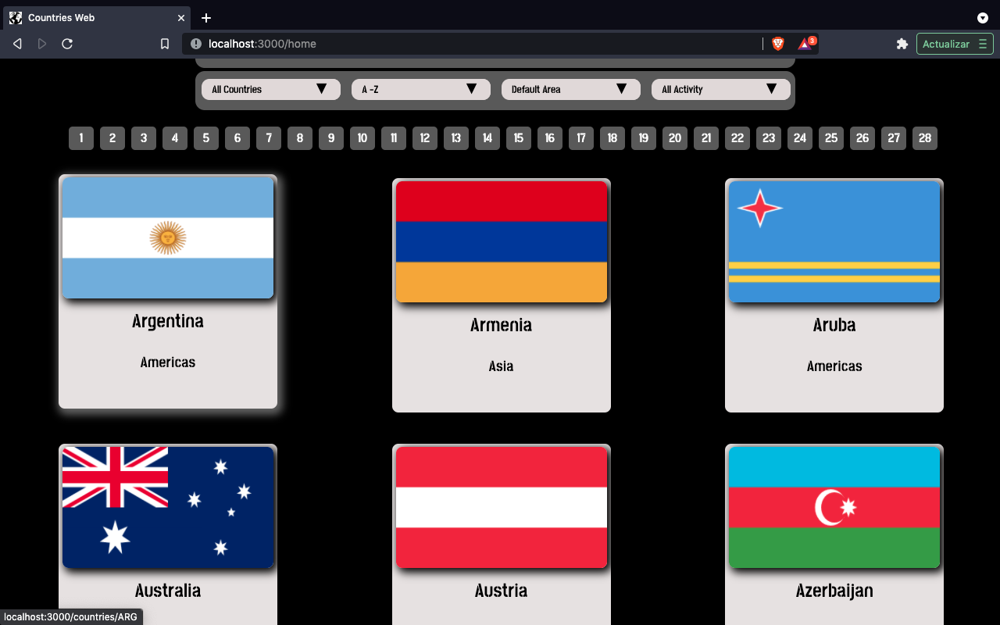
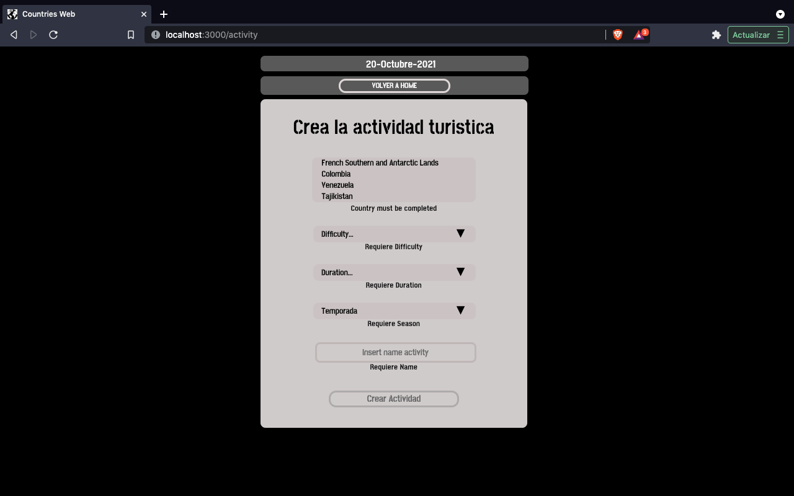
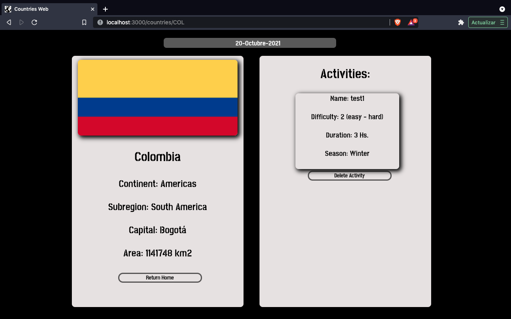

<!-- 

    

 -->

# Individual Project - Countries App
<!-- 

  

 -->

## Objetivos que se cumplieron: 

- Construir una App utlizando React, Redux, Node y Sequelize.
- Afirmar y conectar los conceptos aprendidos en la carrera.
- Aprender mejores prácticas.
- Aprender y practicar el workflow de GIT.
- Usar y practicar testing.

## ¿Que hace la app?: 

  - Busca paises
  - Filtrados (Continent, Activities) 
  - Ordenamientos (Area, Population, Alphabetic)
  - Crear/Eliminar actividades turísticas

## Endpoint que se utilizo:

  - GET https://restcountries.com/v2/all

## Tecnologías utilizadas:

- [ ] React
- [ ] Redux
- [ ] Css (Pure)
- [ ] Express
- [ ] Sequelize - Postgres

## App images:

#### Landing:

  

#### Load:

  

#### Pagina 1:

  

#### Pag(2) order A-Z:

  

#### Create Activity:

  

#### Country Detail:

  

